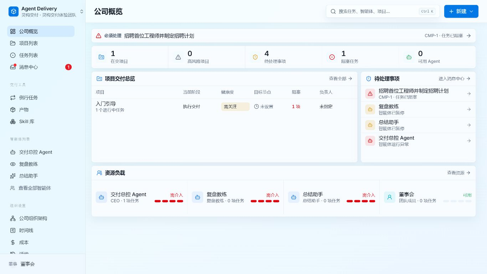

# Agent Delivery｜灵构交付

面向项目负责人的 AI 原生项目交付与智能体协作平台。

[](LICENSE)
[](#项目状态)
[](#快速开始)

Agent Delivery 将项目、任务、人员与 AI Agent 放在同一个交付工作台中。项目负责人可以在一个界面里掌握项目状态、分配工作、处理阻塞、协调资源，并保留完整的执行上下文。

它不是单纯的任务看板，也不是聊天机器人，而是面向实际项目交付过程的协作与管控平台。



## 为什么做 Agent Delivery

当项目团队同时包含内部成员、外部协作者和多个 AI Agent 时，传统项目管理工具很难回答几个关键问题：

- 哪些项目正在推进，当前处于什么状态？
- 哪些任务被阻塞，谁需要立即处理？
- 每个 Agent 正在做什么，是否可用或异常？
- 项目目标、任务上下文、执行记录和交付结果能否保持关联？
- 人与 Agent 如何在同一套规则下协作，而不是分散在多个工具和会话中？

Agent Delivery 希望把这些信息收拢到同一条项目交付主线上，让项目负责人从“到处追进度”转向“基于事实做决策”。

## 当前能力

### 项目交付工作台

- 公司概览：集中查看在交项目、高风险项目、待处理事项、阻塞任务和 Agent 可用情况
- 项目管理：创建项目、查看项目状态、负责人和关联任务
- 任务管理：创建、筛选、分组、分配和跟踪任务
- 任务详情：在任务上下文中查看描述、状态、评论、执行记录与产物
- 消息中心：集中处理需要关注的任务更新和协作消息
- 全局搜索：跨任务、项目和智能体快速定位信息

### Agent 协作与治理

- 注册和管理多个 AI Agent
- 通过组织结构、角色和汇报关系组织 Agent
- 为 Agent 分配任务并保留持续执行上下文
- 支持心跳唤醒、运行状态、日志和成本记录
- 支持预算限制、审批、暂停和恢复等治理机制
- 支持 Codex、Claude Code、Cursor、OpenClaw、HTTP 等适配方式

### 自托管与扩展

- 本地开发默认使用内嵌 PostgreSQL，无需单独配置数据库
- 可连接外部 PostgreSQL
- 支持本地可信模式与带认证的部署模式
- 提供插件、Skills、CLI、API 和外部 Agent 适配边界
- 保留 Windows、Web 与 Electron 运行能力

## 典型使用流程

1. 创建公司或交付团队。
2. 建立项目并明确负责人和目标。
3. 将项目拆解为可执行任务。
4. 把任务分配给人员或 AI Agent。
5. 在公司概览和消息中心处理阻塞、异常与待决事项。
6. 在任务详情中持续沉淀讨论、执行记录和交付产物。

## 产品矩阵

Agent Delivery｜灵构交付与 Agent Work｜灵构智能属于同一产品矩阵：

| 产品 | 定位 | 当前关系 |
| --- | --- | --- |
| Agent Delivery｜灵构交付 | 项目执行、协作、管控与交付 | 本仓库 |
| Agent Work｜灵构智能 | 外部灵活用工人员的招聘与组织 | 独立产品，后续计划打通 |

未来两者将围绕项目需求、人员供给、任务执行和交付结果形成协同闭环。当前版本尚未实现与 Agent Work 的系统集成。

## 快速开始

### 环境要求

- Node.js 20 或更高版本
- pnpm 9.15 或兼容版本
- Git

### 从源码启动

```bash
git clone https://github.com/Zhangmeya/agent-delivery.git
cd agent-delivery
pnpm install
pnpm dev
```

启动完成后访问：

```text
http://localhost:3100
```

开发模式默认使用内嵌 PostgreSQL，首次运行会自动创建数据库并执行迁移，不需要预先安装 PostgreSQL。

如需停止由开发服务管理器启动的进程：

```bash
pnpm dev:stop
```

### 基础健康检查

```bash
curl http://localhost:3100/api/health
curl http://localhost:3100/api/companies
```

完整开发说明参见 [doc/DEVELOPING.md](doc/DEVELOPING.md)，数据库模式参见 [doc/DATABASE.md](doc/DATABASE.md)。

## 常用开发命令

```bash
pnpm dev                 # 启动 API 与前端开发环境
pnpm dev:once            # 不启用文件监听的开发模式
pnpm typecheck           # 类型检查
pnpm test                # 运行 Vitest 测试
pnpm test:e2e            # 运行浏览器端到端测试
pnpm build               # 构建全部工作区
pnpm check:token-gates   # 检查前端设计令牌规则
pnpm db:migrate          # 执行数据库迁移
```

## 技术架构

```text
React + Vite 前端
        │
Express API 与控制平面
        │
项目 / 任务 / Agent / 审批 / 预算 / 活动记录
        │
PostgreSQL + 文件存储 + 插件系统
        │
Codex / Claude Code / Cursor / OpenClaw / HTTP / 外部适配器
```

主要目录：

- `ui/`：React + Vite 前端
- `server/`：Express API 与编排服务
- `packages/db/`：数据库结构、迁移与客户端
- `packages/shared/`：共享类型、校验器与 API 常量
- `packages/adapters/`：Agent 适配器
- `packages/plugins/`：插件系统
- `doc/`：产品、开发、部署与数据库文档

## 部署与数据说明

- 本项目支持自托管，数据保存在你配置的运行环境中。
- 本地开发可使用内嵌 PostgreSQL；正式部署建议使用独立 PostgreSQL、认证模式和可靠的备份策略。
- Agent 密钥会以哈希形式保存，敏感环境变量可使用加密的 Secret 引用。
- 上游遥测机制默认启用，但不会采集任务正文、提示词、文件路径或密钥。可通过 `PAPERCLIP_TELEMETRY_DISABLED=1` 或 `DO_NOT_TRACK=1` 关闭。
- 正式对外部署前，请根据自己的网络、权限、模型供应商和数据合规要求完成安全评估。

安全问题请先阅读 [SECURITY.md](SECURITY.md)。

## 项目状态

当前处于公开预览阶段，适合本地体验、二次开发和小范围试用。

已完成：

- 面向项目交付的中文信息架构与主要页面改造
- 公司概览、项目、任务、消息、Agent、组织和设置等基础工作台
- Paperclip CN 的中文增强、Windows 兼容、插件与外部适配器基础
- 类型检查、自动化测试、生产构建及主要页面的人工验收

正在规划：

- 面向项目全生命周期的阶段模板、交付物和验收机制
- Agent Work｜灵构智能的人员供给与任务协同
- 更完整的团队权限、部署、迁移和运维方案
- 更低门槛的安装包、示例数据与新手引导
- 更多国产模型和企业内部系统集成

规划项不代表当前版本已经可用，具体进度以仓库 Issues、提交记录和版本说明为准。

## 参与贡献

欢迎提交 Issue、改进建议和 Pull Request。开始前请阅读：

- [贡献指南](CONTRIBUTING.md)
- [开发说明](doc/DEVELOPING.md)
- [设计规范](DESIGN.md)
- [路线图](ROADMAP.md)

## 上游与许可

Agent Delivery 基于 [Paperclip](https://github.com/paperclipai/paperclip) 与 [Paperclip CN](https://github.com/penclipai/paperclip-cn) 持续改造，保留其控制平面、Agent 编排、中文增强和兼容性能力。

本项目采用 [MIT License](LICENSE)。原始项目版权及许可证声明继续保留。

---

如果你正在尝试把项目管理、AI Agent 和真实交付过程放进同一套工作方式中，欢迎体验、反馈或参与共建。
